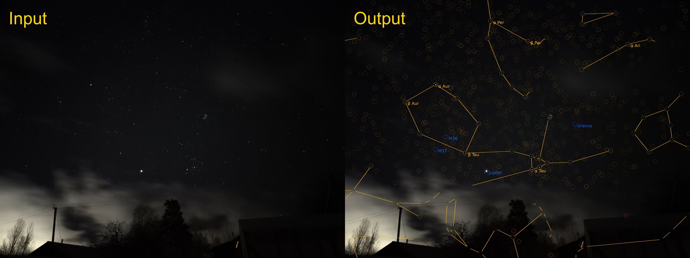

# Star Solver

A Python library and a [web app](https://vadim-v-lebedev.github.io/starsolver/) designed for constellation identification on nighttime smartphone photos, by matching the light sources in the image to the stars in the Hipparcos catalogue (powered by [tetra3](https://github.com/esa/tetra3)). Basically this is the same thing that Stellarium does via accelerometer and compass data but done in a much more computationally complex way.

## What it does

- **Load** — pick your photo from the gallery.
- **Detect** — runs a custom point source detector.
- **Mask** — draw a foreground mask to remove false positive detections if necessary.
- **Solve** — runs tetra3 for blind [plate solving](https://en.wikipedia.org/wiki/Astrometric_solving) and draws the visible constellations. The FOV value, which helps plate solving tremendously, is taken from the image EXIF data. Disable or change it manually if the image was cropped or edited in some similar way.
- **Refine** — an iterative algorithm that accurately fits the coordinate system and performs rudimentary photometry, aiming to identify every object in the picture. After this step, every detected point source is marked either as an identified star (gold circle), a non-star object (currently, this includes planets and Messier objects), or as an unidentified object (red circle).
- **Save** — save your results for posterity, closer inspection or sharing.

The web app builds a summary of what was processed in the **Achievements** tab, listing all the constellations and planets that appeared on the photos. This tab also contains the panorama feature: project the processed images into the celestial sphere one-by-one and watch foreground objects stick out in all directions due to Earth's rotation.

## Tech

This was mostly generated by Claude Code. The project uses Pyodide to run Python in the browser, tetra3 as a plate solving engine, PIL for all image processing and numpy for all sorts of things.
